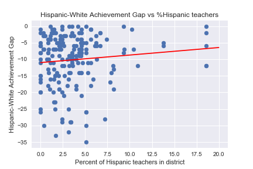

# Bridging the Achievement Gap

The purpose of this project is to explore the relationship between the Hispanic-White Achievement Gap in Illinois high schools and teacher/student racial demographics.

The web-scraping for data collection was done using the python Selenium library and is stored in the notebook titled **[Web_Scraping_Methods_and_Data_Collection](Web_Scraping_Methods_and_Data_Collection.ipynb)**.

Click on the image below to view an example of the scraping in action on youtube:

The most surprising result was that the correlation between the *Hispanic-White Achievement Gap* and the *Percent of hispanic teachers in the district* was not statistically significant .

It is still a work in progress.
The code for data analysis can be found in this notebook: **[Achievement_Gap_Data_Analysis](Achievement_Gap_Data_Analysis.ipynb)**

### Updates:

02/14/18: Lots of new changes. The webscraping script notebook is a lot more robust, can handle collection interruptions much better, and has scraped some new information.
A new notebook **[Obtaining_Accurate_Teacher_Ethnicities](Obtaining_Accurate_Teacher_Ethnicities.ipynb)** has been created with the goal of incorporating teacher ethnicity at the school level, rather than at the district level (the Illinois Report Card website only had district-level demographics for teachers).
The **[Achievement_Gap_Data_Analysis](Achievement_Gap_Data_Analysis.ipynb)** still needs to be updated to account for an influx of new data.