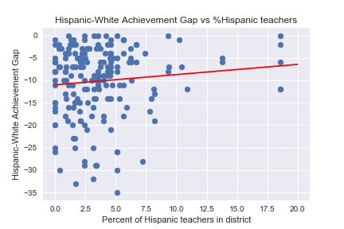

# Bridging the Achievement Gap

The purpose of this project is to explore the relationship between the Hispanic-White Achievement Gap in Illinois high schools and teacher/student racial demographics.

The web-scraping for data collection was done using the python Selenium library and is stored in the notebook titled **[Web_Scraping_Methods_and_Data_collection](Web_Scraping_Methods_and_Data_collection.ipynb)**.

The most surprising result was that the correlation between the *Hispanic-White Achievement Gap* and the *Percent of hispanic teachers in the district* was not statistically significant \( R^2 = 0.00 \).
