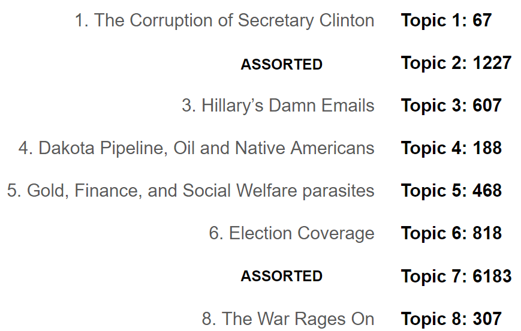

# The Fake News ClusterFlock

**02/15/18 Note:** ***The output cells for this project's notebook were somehow erased on an AWS EC2 instance. I plan on running them again in the near future***

## Background

Given the explosion of "fake news" available in our society today and its toxic effect on political discourse, I attempt to use unsupervised learning to cluster the fake news published around the time of the 2016 Presidential election into distinct categories.

Despite the current political climate (as of Feb 2018), I still carry (non data-driven) hope that this phase of disgraceful political rhetoric shall come to pass.

When I started this project, I wanted to know if there were broad categorical themes present in published fake news. A Kaggle dataset already had articles pre-classified as fakenews.

## Goal:

Using Unsupervised Learning and Natural Language Processing, cluster the articles to elucidate patterns in article content.

## Clustering Algorithms:

For this project I used K-Means, DBSCAN, Agglomerative Clustering algorithms.

## Results:

These were the Clusters that were elucidated from the structure.

**More Coming Soon**