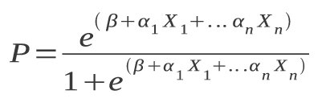
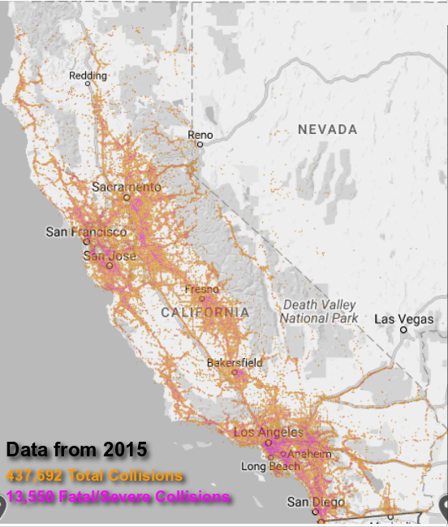
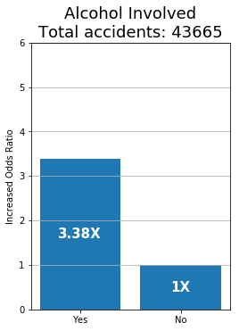
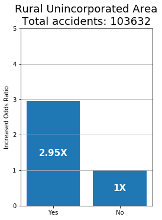
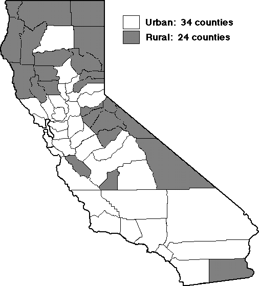
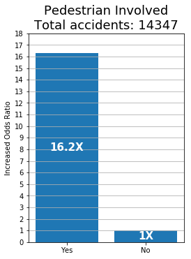
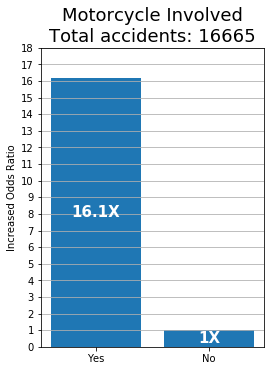
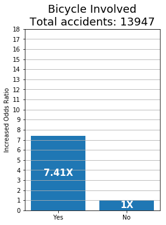

# Driven to Death

## Background:

A few days before I began this project, my brother had gotten into a pretty severe car accident which totaled his car. I wanted to find out the factors related to the severity of collisions to propose data-driven recommendations to state agencies for transportation safety improvements.

## Goal:

Build an explainable model to determine whether an accident is severe/fatal or not. Based on the factors suggest data-driven actions to lower the incidence of fatal/severe accidents.

## Approach:

A logistic regression was used for this project because of the ease of explaining the importance of factors using the logistic equation. The details may be explained in a future blog post.

## Exploratory Visualization:

While I would have preferred to have Illinois data for this project, I had easier access to data on collisions in California during 2015, made available by the California Highway Patrol.

The following image contains the locations of all the collisions taking place in California, color coded for severity:

The pink shows the severe/fatal accidents. The orange shows the less severe ones.

## Takeaways from Analysis:

1. If alcohol is involved, all other things being equal, the model suggests the likelihood of the accident being severe/fatal is **3.38 times higher**. Alcohol-related accidents account for around 1/10 of all collisions.

2. California has 34 Urban Counties and 24 Rural Counties. The model suggests that in rural locations, all other factors being equal, a collision is **2.95 times more likely** to result in a severe/fatal accident. Rural Accidents aacount for 1/4 of all collisions.

  

	This may be explained in part due to higher speed limits in rural areas and in some cases, highways that are not divided.

3. Pedestrians, Motorcyclists, and Bicyclists are in mortal danger when collisions occur.

  

## Final Recommendations:

1. Use "Traffic Calming" measures like those piloted in Louisiana and Washington to enhance Pedestrian and Bicyclist safety.
These include:
	 - Speed bumps
	 - Roundabouts
	 - Chokepoints

	The added environmental benefit to these recommendations is that motorists will become so fedup with increased congestion that they will be forced to switch to public transportation.

2. Implement physical highway dividers in rural areas to prevent the incidence of head-on collisions